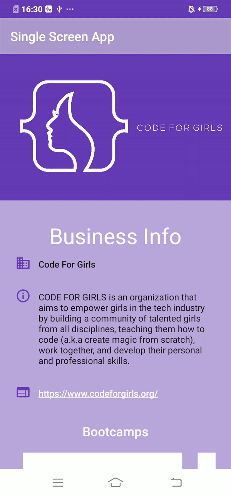

# Single Screen App

Single Screen App is Android app that display information about a specific business. I chose [code for girls](https://www.codeforgirls.org/) business to be my example. This app built using the XML file and the default library only.

# Result

License
---

MIT

